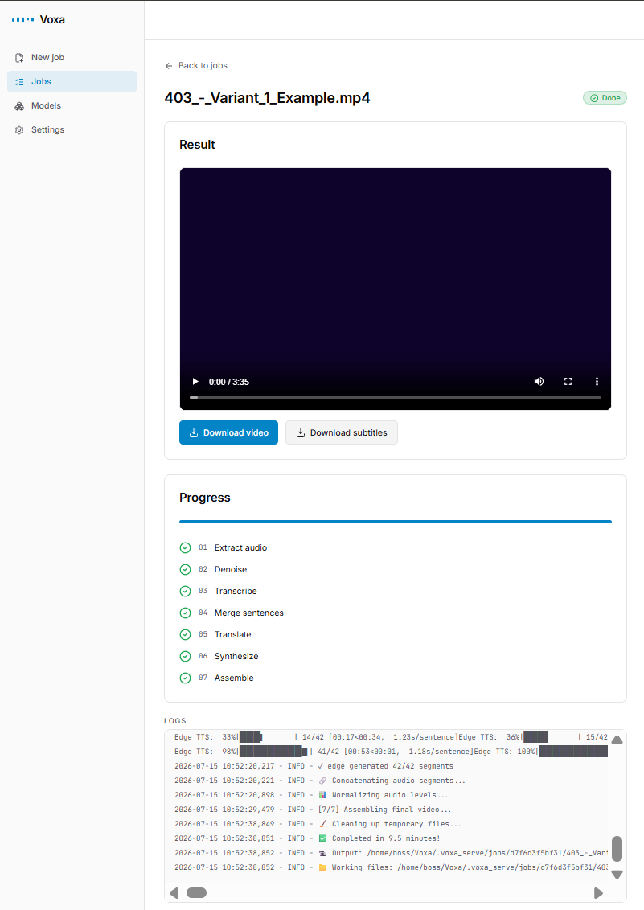

<div align="center">

# Voxa

**Dub any video into another language — and keep it in sync.**

Voxa transcribes a video, translates it with context, speaks it in the target language, and
mixes the result back over the original. The engine is one Python file with four speech
engines, four translation backends, and one non-negotiable property: the dub does not drift
away from the speaker.

[](https://github.com/akshinmrv/Voxa/actions/workflows/ci.yml)
[](https://github.com/akshinmrv/Voxa/releases)
[](LICENSE)
[](https://www.python.org/downloads/)
[](https://github.com/astral-sh/ruff)

</div>

```bash
pipx install voxa-dub
voxa talk.mp4 --target_lang ru        # → talk_dubbed_ru.mp4
```

<div align="center">

🎧 **[Hear the demo dubs](https://voxa-servoogle.vercel.app)** — English → Turkish, Azerbaijani
and French, produced with no API key

</div>

---

## Overview

Most dubbing tools concatenate synthesized clips one after another. A clip that runs slightly
long pushes the next one later, the error accumulates, and three minutes in the dub is a
sentence behind the speaker.

Voxa places every clip **anchored to the source timeline**. The slot for a line runs from its
own onset to the *next line's* onset. A clip that over-runs is trimmed to fit; a short one is
padded with silence. The cursor is assigned, never accumulated — so drift is structurally
impossible.

Everything else follows from that decision: the translator is given a character budget so the
line fits its slot at a natural pace, speech is only ever sped up (never slowed down, which
sounds dragged), and segment starts are tightened to the first word's timestamp so the dub
does not begin before the speaker does.

```bash
voxa talk.mp4 --target_lang ru
# → talk_dubbed_ru.mp4 + subtitles_ru.srt
```

No API key is required. The defaults work out of the box.

## Features

| Capability | Detail |
|---|---|
| **Video dubbing** | Dubbed voice mixed over the original as a faint ambience bed; video stream copied without re-encoding |
| **Speech recognition** | `openai-whisper` (tiny → turbo) or `faster-whisper` (2–4× faster, built-in VAD, no torch) |
| **Automatic translation** | Google, Ollama (local), OpenAI, Anthropic |
| **Context-aware translation** | Lines are translated in blocks, not one by one, so pronouns, gender, names and tone stay consistent across a scene |
| **Duration-matched translation** | Each line gets a character budget, so the dub fits its slot at a natural pace instead of being sped up |
| **Subtitle processing** | SRT output, `--subtitles-only` mode, built-in SubRip parser (no GPL dependency) |
| **Voice cloning** | XTTS v2 from a short reference sample, auto-extracted from the source if you don't supply one |
| **OpenAI TTS** | `gpt-4o-mini-tts` with instructable delivery |
| **Expressive delivery** | `--detect-emotion` selects native voice styles on Edge; on OpenAI TTS an LLM tags each line with an emotion/energy/pace instruction |
| **Self-hosted speech** | `--openai-tts-base-url` drives any OpenAI-compatible `/v1/audio/speech` server — no API key, no extra dependency |
| **Offline speech** | Piper, fully offline after the model download |
| **Anchored placement** | Over-runs are trimmed with a fade; short clips are padded; drift cannot accumulate |
| **Quality gate** | Each clip is transcribed back and scored (word error rate, clipping, silence, pacing), with a per-job report |
| **Auto-regeneration** | XTTS sampling is stochastic, so a flagged segment is re-synthesized up to twice and the best take is kept |
| **Batch processing** | Pass several videos in one command |
| **Resumable runs** | Every step is checkpointed; an interrupted job resumes instead of restarting |
| **Preflight validation** | Missing input files and a missing FFmpeg are reported before any work begins |
| **Configuration** | `.env` loading, JSON config defaults, structured JSON logging |
| **Extensible** | New speech or translation providers are one adapter plus one registry line |

> [!NOTE]
> Voxa ships no model weights and vendors no third-party code. It orchestrates tools you
> install yourself. See [NOTICE.md](NOTICE.md) before using it commercially.

## Supported Languages

| Layer | Coverage |
|---|---|
| **Transcription** | Whisper's full language set, auto-detected |
| **Translation** | 74 target languages carry a full language name into the LLM prompt; Google accepts more |
| **Edge TTS** | 100+ locales, including native `az-AZ` voices |
| **OpenAI TTS** | Multilingual; strongest on major languages |
| **Piper** | 15 bundled voice mappings, fully offline |
| **XTTS** | 17 — `ar` `cs` `de` `en` `es` `fr` `hi` `hu` `it` `ja` `ko` `nl` `pl` `pt` `ru` `tr` `zh` |

### Which engine for which language?

There is no universal answer, and the cloud engine does not always win — a voice that
genuinely covers a language usually beats a larger model that only approximates it. Which is
why Voxa ships the measurement rather than a verdict.

`--quality-gate` transcribes every synthesized clip back with a second ASR model and scores it
by word error rate, so you can check the engines against **your** content:

```bash
voxa clip.mp4 --target_lang az --tts edge --quality-gate --gate-model base
```

[`docs/BENCHMARK.md`](docs/BENCHMARK.md) has a reproducible script, a worked run across six
languages, and — just as important — the limits of what a number like this can tell you.

> [!TIP]
> If a language has a dedicated native neural voice in Edge, try it first. For a low-resource
> language use `--gate-model base` or larger: a `tiny` gate model misreads a perfectly good
> voice and reports a worse score than it deserves.

> [!IMPORTANT]
> **A WER figure only means something next to the clip it came from.** The same engine and
> language score very differently on different source material — one proper noun in a short
> clip can move the average enormously. Treat any published number, including ours, as a
> starting point for your own measurement rather than a ranking.

## Supported Models

| Stage | Models |
|---|---|
| Transcription | `tiny` · `base` · `small` · `medium` · `large` · `turbo` (`large-v3-turbo` on the faster backend) |
| Translation (OpenAI) | `gpt-5` (default), `gpt-5-mini`, any chat model id |
| Translation (Anthropic) | `claude-opus-4-8` (default), `claude-sonnet-5`, any model id |
| Translation (Ollama) | `llama3` (default), any local model |
| Speech (OpenAI) | `gpt-4o-mini-tts` |
| Delivery direction | `gpt-4o-mini` — one cheap call per job, cached |
| Voice cloning | XTTS v2 |
| Offline speech | Piper voices |
| Quality gate | `faster-whisper` (`tiny` default, `base` recommended for low-resource languages) |

## Architecture Overview

```
                         Video
                           │
                           ▼
              ┌─────────────────────────┐
              │   Speech Recognition    │  Whisper / faster-whisper
              │                         │  + word-onset refinement
              │                         │  + non-speech filtering
              └────────────┬────────────┘
                           ▼
              ┌─────────────────────────┐
              │       Translation       │  Google · Ollama · OpenAI · Anthropic
              │                         │  context-aware, length-budgeted
              └────────────┬────────────┘
                           ▼
              ┌─────────────────────────┐
              │     Text-to-Speech      │  Edge · OpenAI · Piper · XTTS
              │                         │  one shared timeline driver
              └────────────┬────────────┘
                           ▼
              ┌─────────────────────────┐
              │    Audio Processing     │  fit (speed up only)
              │                         │  anchored placement
              │                         │  2-pass loudnorm
              └────────────┬────────────┘
                           ▼
                      Dubbed Video
```

Every stage is checkpointed in `<video>_work/`. See [docs/ARCHITECTURE.md](docs/ARCHITECTURE.md)
for why the cursor is assigned rather than accumulated, how the two provider registries work,
and where each concern lives in the code.

## Demo

One 15-second English clip, dubbed into three languages from a single transcription. Every
dub below was produced with the **default engines and no API key**:

```bash
voxa clip.mp4 --target_lang tr        # then --target_lang az, --target_lang fr
```

| Target | Engines | Listen |
|---|---|---|
| 🎬 Original (English) | — | [play ▶](https://voxa-servoogle.vercel.app) · [`original.mp4`](web/public/demo/original.mp4) |
| 🇹🇷 Turkish | `google` + `edge` | [play ▶](https://voxa-servoogle.vercel.app) · [`dub_tr.mp4`](web/public/demo/dub_tr.mp4) |
| 🇦🇿 Azerbaijani | `google` + `edge` | [play ▶](https://voxa-servoogle.vercel.app) · [`dub_az.mp4`](web/public/demo/dub_az.mp4) |
| 🇫🇷 French | `google` + `edge` | [play ▶](https://voxa-servoogle.vercel.app) · [`dub_fr.mp4`](web/public/demo/dub_fr.mp4) |

The second and third languages reused the cached transcription, so only translation and speech
were regenerated — the timeline is identical across all three.

<!--
  To play a video inline on GitHub rather than linking to it, upload the file to a GitHub
  issue or release, copy the resulting https://github.com/user-attachments/... URL, and paste
  it below. Repository-relative paths do not render inline on GitHub.
-->
<!-- DEMO_TR --> <!-- DEMO_AZ --> <!-- DEMO_FR -->

## Installation

**1. FFmpeg** — Voxa checks for it at startup and tells you if it's missing.

```bash
sudo apt install ffmpeg      # Debian / Ubuntu
sudo dnf install ffmpeg      # Fedora / RHEL
brew install ffmpeg          # macOS
winget install Gyan.FFmpeg   # Windows
```

**2. Voxa** — Python 3.9 or newer.

```bash
pipx install voxa-dub          # recommended: isolated, puts `voxa` on your PATH
```

Or run it once without installing anything:

```bash
uvx voxa-dub talk.mp4 --target_lang ru
```

<details>
<summary>From source (for development)</summary>

```bash
git clone https://github.com/akshinmrv/Voxa
cd Voxa
python3 -m venv venv && source venv/bin/activate   # Windows: venv\Scripts\activate

# The CPU-only torch wheel keeps the install considerably smaller.
# Have an NVIDIA GPU? Install the CUDA wheel instead — see "4. GPU acceleration" below.
pip install torch --index-url https://download.pytorch.org/whl/cpu

pip install .
```

</details>

> [!NOTE]
> The distribution is named **`voxa-dub`** (the `voxa` name on PyPI belongs to an unrelated,
> abandoned package). The command it installs is **`voxa`** — that is what every example below
> uses. Running the script directly, `python voxa.py …`, is equivalent.

<details>
<summary>Docker — no Python, torch or ffmpeg on the host</summary>

```bash
docker run --rm -v "$PWD:/data" ghcr.io/akshinmrv/voxa talk.mp4 --target_lang ru
```

The dub lands next to the input on your host. The defaults need no API key; pass one through
with `-e OPENAI_API_KEY=...` if you switch engines. Keep the downloaded Whisper models between
runs by mounting the cache:

```bash
docker run --rm -v "$PWD:/data" -v voxa-cache:/cache \
    ghcr.io/akshinmrv/voxa talk.mp4 --target_lang ru
```

The image is ~3.7 GB, almost all of it the CPU build of torch. `voxa serve` runs in the
container too (`serve --host 0.0.0.0`), but its settings endpoints are restricted to loopback
callers and a port-mapped request does not qualify — run the console natively for those.

</details>

**3. Optional engines** — install only what you use.

| Command | Enables |
|---|---|
| `pipx install "voxa-dub[faster]"` | `--whisper-backend faster` — 2–4× quicker, no torch |
| `pipx install "voxa-dub[piper]"` | `--tts piper` — fully offline |
| `pipx install "voxa-dub[anthropic]"` | `--translator anthropic` |
| `pipx install "voxa-dub[xtts]"` | `--tts xtts` voice cloning |

> [!WARNING]
> `voxa-dub[xtts]` installs [`coqui-tts`](https://github.com/idiap/coqui-ai-TTS), the maintained
> community fork. The **XTTS-v2 model weights are non-commercial** (CPML), and Coqui Inc. no
> longer exists to sell a commercial licence. For commercial voice cloning, drive an
> MIT-licensed engine through `--openai-tts-base-url`.

**4. GPU acceleration** — optional, NVIDIA only.

Voxa detects CUDA on its own; there is no flag to turn it on. What it speeds up:

| Stage | On GPU |
|---|---|
| Whisper transcription (both backends) | ✅ CUDA, fp16 |
| XTTS voice cloning | ✅ CUDA |
| Quality gate (WER scoring) | ✅ CUDA |
| Translation — Google / OpenAI / Anthropic | ➖ network-bound |
| Translation — Ollama | ➖ Ollama uses your GPU on its own |
| Speech — Edge / OpenAI | ➖ cloud |
| Speech — Piper | ➖ CPU (ONNX) |

Install the **CUDA** build of PyTorch instead of the CPU wheel from step 2:

```bash
# Match the CUDA version your driver supports — https://pytorch.org/get-started/locally/
pip install torch --index-url https://download.pytorch.org/whl/cu124
```

Check it took:

```bash
python -c "import torch; print(torch.cuda.is_available())"   # → True
```

When the GPU is in use, the run log prints `⚙️  Using device: CUDA` at the transcription step
(it prints `CPU` otherwise). Rough VRAM per Whisper model: `tiny`/`base` ≈ 1 GB, `small` ≈ 2 GB,
`medium` ≈ 5 GB, `turbo` ≈ 6 GB, `large` ≈ 10 GB; XTTS wants roughly 4 GB more.

> [!NOTE]
> `--whisper-backend faster` (CTranslate2) runs on the GPU too, but needs NVIDIA's cuBLAS and
> cuDNN libraries: `pip install nvidia-cublas-cu12 nvidia-cudnn-cu12`.
> Voxa checks for **CUDA only** — Apple Silicon (MPS) and AMD GPUs fall back to CPU.

## Configuration

**API keys.** Copy `.env.example` to `.env` (gitignored) and fill it in. Voxa loads it on
startup; real environment variables always win. Prefer this over `--openai_api_key`, which
lands in your shell history and the process list.

```dotenv
OPENAI_API_KEY=sk-...
ANTHROPIC_API_KEY=sk-ant-...
```

**Defaults.** Put common options in a JSON file. Keys are the long option names with dashes as
underscores; explicit flags override the file. A complete example lives in
[`examples/config.json`](examples/config.json).

```bash
voxa video.mp4 --config examples/config.json
```

**Logging.** `--log-format json` emits one JSON object per line. `--verbose` raises the level
to DEBUG and also surfaces third-party libraries.

**All options:** `voxa --help`. It is generated from the code, so unlike a README table it can
never go stale.

## Quick Start

```bash
# Simplest possible run — no API key, no configuration
voxa video.mp4 --target_lang ru

# Natural, context-aware translation with an LLM
export OPENAI_API_KEY="sk-..."
voxa video.mp4 --target_lang de --translator openai

# Clone the original speaker's voice
voxa video.mp4 --target_lang tr --tts xtts

# Fully offline: local LLM translation, offline speech
voxa video.mp4 --target_lang fr --translator ollama --tts piper

# Subtitles only, no synthesis
voxa video.mp4 --target_lang es --subtitles-only

# Several videos in one command
voxa a.mp4 b.mp4 c.mp4 --target_lang ru

# Score the result instead of guessing
voxa video.mp4 --target_lang az --quality-gate --gate-model base

# Self-hosted speech: any OpenAI-compatible server, no API key
voxa video.mp4 --target_lang tr --tts openai \
     --openai-tts-base-url http://localhost:8004/v1
```

## Optional local console (`voxa serve`)

The CLI is the product. If you'd rather click than type, `voxa serve` starts a local console
that **shells out to the very same `voxa` command** — so the UI cannot drift away from the
engine, because it *is* the engine. It binds to `127.0.0.1`; nothing is uploaded anywhere.

<div align="center">

<br>
<sub>Upload a video, pick engines, watch the seven-step pipeline live, download the dub.</sub>
</div>

```bash
# Backend: REST + SSE, drives the same pipeline per job
pipx install "voxa-dub[serve]"
voxa serve                              # http://127.0.0.1:8000

# Frontend (separate terminal)
cd web && npm install && npm run dev    # http://localhost:3000  →  /en/app
```

It also carries the settings the CLI reads: API keys (kept in your local `.env`, never echoed
back), per-provider models with a connection test, translation style, and speech style presets.

The repository also contains the public landing site in [`web/`](web/) — a trilingual
(EN/AZ/TR) showcase, deployable as a static site. See [`web/README.md`](web/README.md) for
development, environment variables, and deployment.

## Project Structure

```
Voxa/
├── voxa.py                     # The entire tool: pipeline, engines, registries, CLI
├── voxa_server.py              # `voxa serve` operator backend (FastAPI; optional [serve] extra)
├── web/                        # Web frontend: public landing + local operator app
├── pyproject.toml              # Packaging, extras, ruff and pytest configuration
├── requirements.txt            # Core dependencies (optional engines live in extras)
│
├── tests/
│   ├── test_voxa.py            # Unit tests: parsing, timing maths, scoring, adapters
│   ├── test_golden.py          # Golden harness: the same functions composed
│   └── golden/                 # Recorded inputs and expected outputs
│
├── docs/
│   ├── ARCHITECTURE.md         # Design decisions and where each concern lives
│   ├── RELEASING.md            # Release checklist
│   └── assets/                 # Demo videos and images
│
├── examples/
│   └── config.json             # A complete, verified configuration file
│
├── .github/
│   ├── workflows/ci.yml        # ruff + pytest on Python 3.9–3.12
│   ├── workflows/release.yml   # A tag becomes a release only if it passes
│   ├── ISSUE_TEMPLATE/         # Bug report and feature request forms
│   └── dependabot.yml
│
├── README.md
├── CHANGELOG.md
├── CONTRIBUTING.md
├── SECURITY.md
├── CODE_OF_CONDUCT.md
├── NOTICE.md                   # Third-party licences and commercial-use guidance
└── LICENSE                     # MIT
```

## Roadmap

Direction, not a promise. Anything requiring hardware or a paid key waits until it can be
tested honestly.

| Item | Status | Note |
|---|---|---|
| Parallel synthesis for network engines | Planned | Requests are issued sequentially today; this is the main performance headroom |
| Azure Neural TTS adapter | Blocked | Needs an API key to test. Official `az-AZ` voices and real SSML prosody |
| Speaker similarity and MOS scoring | Considering | Would extend the quality gate beyond word error rate |
| Wider golden set | Considering | More languages and edge cases in the regression harness |
| Demo assets | Open | Before/after clips in `docs/assets/` |

Have a use case that isn't covered? [Open an issue.](https://github.com/akshinmrv/Voxa/issues)

## FAQ

<details>
<summary><strong>Do I need an API key?</strong></summary>

No. The defaults — Whisper, Google Translate and Edge TTS — need no key. A key is only
required for OpenAI/Anthropic translation or OpenAI speech.
</details>

<details>
<summary><strong>Why does the dub not drift out of sync?</strong></summary>

Each clip is placed in the slot between its own source onset and the next line's onset, and
the timeline cursor is *assigned* to that next onset rather than accumulated from clip
durations. An over-running clip is trimmed instead of pushing everything after it. The
timing maths is pure, unit-tested, and locked by a golden regression harness.
</details>

<details>
<summary><strong>Can I use Voxa commercially?</strong></summary>

Voxa itself is MIT and requires no copyleft dependency. The engines it drives have their own
licences. `--tts piper` with `--translator ollama` is fully permissive; `--tts openai` with
`--translator openai` runs under OpenAI's commercial terms. `--tts xtts` is **not** commercially
usable. See [NOTICE.md](NOTICE.md).
</details>

<details>
<summary><strong>How do I clone a voice for a commercial product?</strong></summary>

Run an MIT-licensed, OpenAI-compatible speech server locally and point Voxa at it:

```bash
voxa video.mp4 --tts openai --openai-tts-base-url http://localhost:8004/v1
```

No API key, no extra Python dependency, and no non-commercial model weights.
</details>

<details>
<summary><strong>Can it run entirely offline?</strong></summary>

Yes: `--translator ollama --tts piper`. Nothing leaves your machine after the models are
downloaded.
</details>

<details>
<summary><strong>Does it re-encode my video?</strong></summary>

No. The video stream is copied. Only the audio track is rebuilt: the original is mixed in at
5% as a faint ambience bed, the dub at 150%, and `amix` halves both so the result cannot clip.
Both levels are configurable.
</details>

<details>
<summary><strong>What does a run cost?</strong></summary>

Nothing with the defaults. With an LLM translator, token usage is logged after every job; add
your model's prices to the `LLM_PRICING` table in `voxa.py` to also print an estimate.
</details>

<details>
<summary><strong>A long job was interrupted. Do I start over?</strong></summary>

No. Every step is checkpointed in `<video>_work/`; rerun the same command and Voxa continues.
Use `--no-resume` to force a clean start.
</details>

<details>
<summary><strong>Does it work on Windows?</strong></summary>

Yes, with FFmpeg on your PATH. CI runs on Linux, and the tool is developed on Windows.
</details>

## Contributing

Issues and pull requests are welcome. [CONTRIBUTING.md](CONTRIBUTING.md) covers the test suite,
how to re-record the golden files, and the two dependency rules that matter: no GPL-licensed
required dependency, and engine-specific packages belong in extras.

Adding a speech engine is one adapter plus one registry line — the timeline, placement, drift
tracking and scoring are already handled for you.

```bash
pip install -e ".[dev]"
ruff check .
pytest
```

---

## License

Voxa is released under the [MIT License](LICENSE).

Voxa ships no model weights and vendors no third-party code, but the engines it drives have
their own licences — some stricter than Voxa's. Read [NOTICE.md](NOTICE.md) before commercial
use.

| Configuration | Commercial use |
|---|:---:|
| `--tts piper` + `--translator ollama` (fully offline) | ✅ |
| `--tts openai` + `--translator openai` (paid APIs) | ✅ |
| `--tts edge` / `--translator google` (defaults, unofficial endpoints) | ⚠️ grey area |
| `--tts xtts` (XTTS-v2 weights are CPML) | ❌ non-commercial only |

## Acknowledgements

Voxa stands on work done by others.

| Project | Role |
|---|---|
| [OpenAI Whisper](https://github.com/openai/whisper) | Speech recognition |
| [faster-whisper](https://github.com/SYSTRAN/faster-whisper) | Faster transcription backend |
| [edge-tts](https://github.com/rany2/edge-tts) | Microsoft neural voices |
| [Piper](https://github.com/rhasspy/piper) | Offline neural speech |
| [coqui-tts](https://github.com/idiap/coqui-ai-TTS) | Maintained fork powering XTTS voice cloning |
| [OpenAI](https://platform.openai.com/) · [Anthropic](https://www.anthropic.com/) | LLM translation and speech |
| [Ollama](https://ollama.com/) | Local, private LLM translation |
| [FFmpeg](https://ffmpeg.org/) | Everything audio and video |

## Author

**Voxa** is built and maintained by **[Akshin Miranov](https://github.com/akshinmrv)** under
the **Servoogle** name.

Servoogle exists to build practical AI tooling — software that solves a real problem end to
end rather than demonstrating a model — and to release the parts that other people can build
on. Voxa is one of those parts. Dubbing a video should not require a studio, a licence
negotiation, or a proprietary pipeline; it should require one command and a machine you
already own.

That is why Voxa is MIT, why it carries no copyleft dependency, why its licence obligations
are documented rather than glossed over, and why every engine sits behind a registry that
anyone can extend. The interesting problems in this space — keeping a dub in sync, making a
synthetic voice sound unhurried, knowing whether the output is actually good — are worth
solving in the open.

If Voxa is useful to you, the most valuable thing you can send back is a bug report with the
log attached.

<div align="center">

---

**Read this in another language:** 🇦🇿 [Azərbaycan](README.az.md) · 🇹🇷 [Türkçe](README.tr.md)

**Voxa** · MIT · [Report a bug](https://github.com/akshinmrv/Voxa/issues) ·
[Contribute](CONTRIBUTING.md) · [Architecture](docs/ARCHITECTURE.md)

</div>
